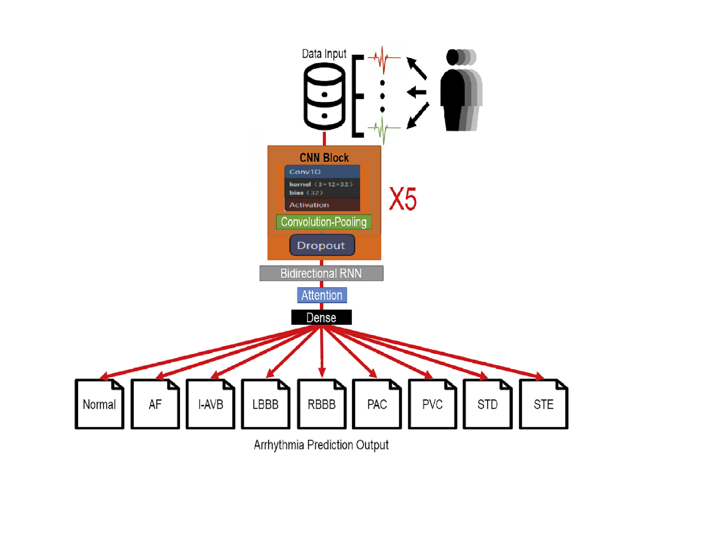
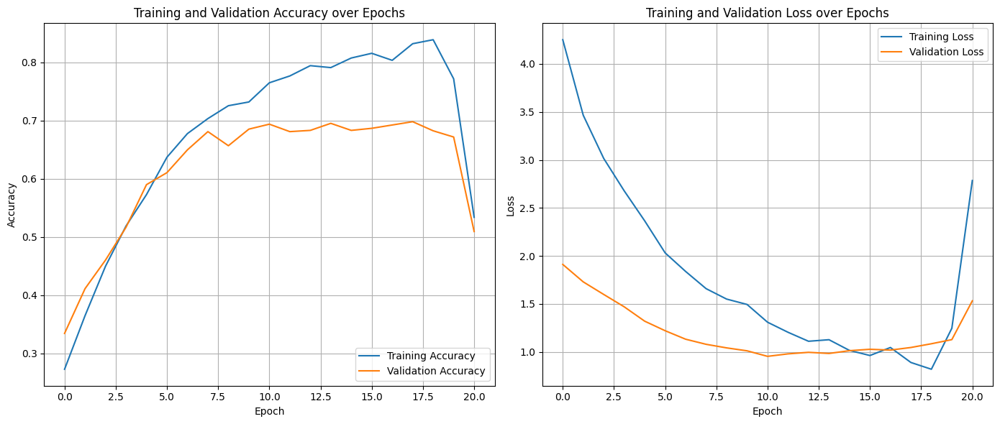
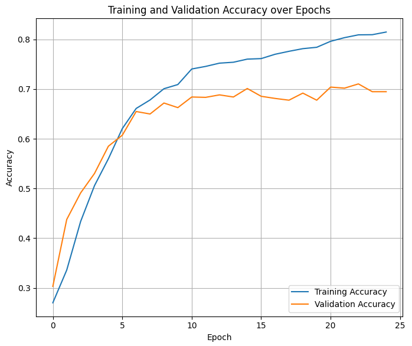
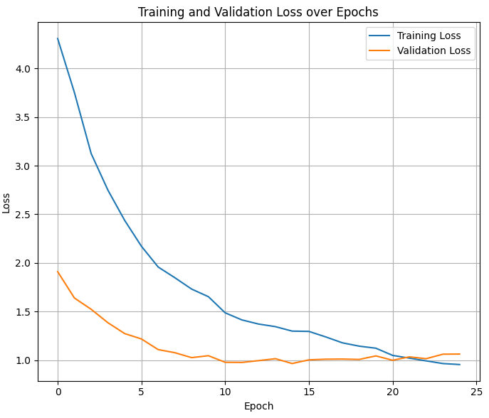
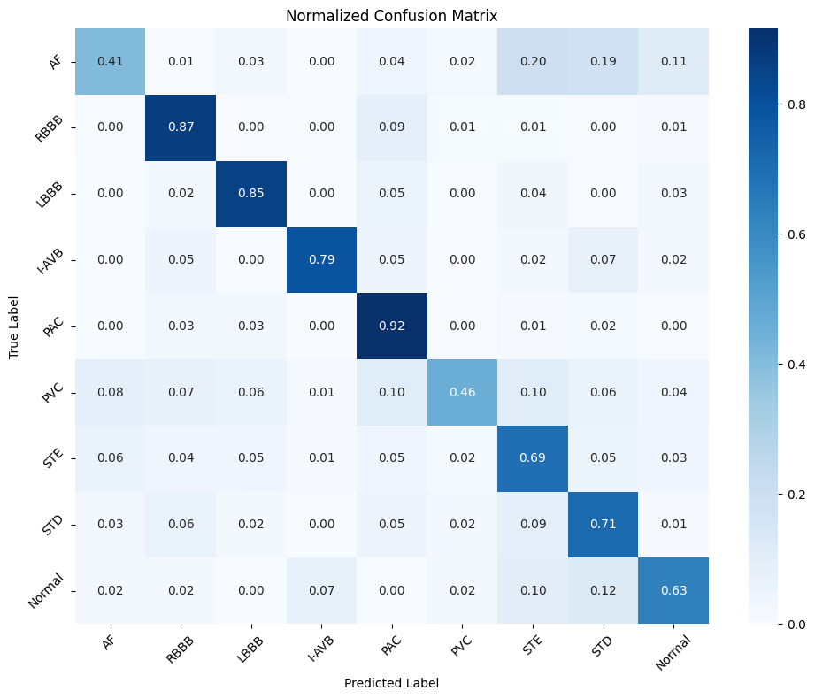
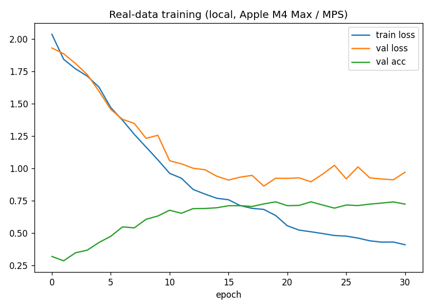
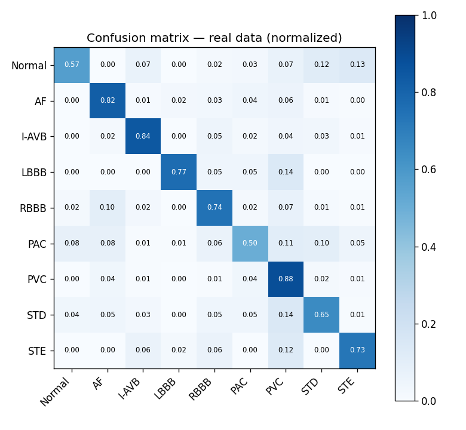

# Classification of Cardiac Arrhythmias from 12-Lead ECG

> A hybrid **CNN + Bidirectional GRU + Attention** deep-learning model that classifies nine types of cardiac arrhythmia from raw 12-lead ECG signals, trained and evaluated on the CPSC-2018 challenge dataset.

<p align="left">
  
  
  
  
</p>

**Course:** Introduction to Artificial Intelligence — Final Project · National Yang Ming Chiao Tung University (NYCU)
**🎬 Video walkthrough:** https://www.youtube.com/watch?v=lN3h-1SXbGI
**▶️ Reproduce on a free GPU:** [](https://colab.research.google.com/github/Kevindic0214/ecg-arrhythmia-classification/blob/main/notebooks/reproduce_cpsc2018_colab.ipynb) — one click downloads the real CPSC-2018 data and runs the full pipeline end-to-end.

---

## Table of Contents
- [Overview](#overview)
- [Motivation](#motivation)
- [Dataset](#dataset)
- [Method](#method)
  - [Model architecture](#model-architecture)
  - [Signal preprocessing](#signal-preprocessing)
- [Experiments](#experiments)
- [Results](#results)
  - [Headline metrics](#headline-metrics)
  - [The overfitting problem — and how we fixed it](#the-overfitting-problem--and-how-we-fixed-it)
  - [Per-class performance](#per-class-performance)
  - [Reproduction on the real dataset](#reproduction-on-the-real-dataset)
- [Discussion & Limitations](#discussion--limitations)
- [Repository structure](#repository-structure)
- [Getting started](#getting-started)
- [References](#references)
- [Team](#team)

---

## Overview

Cardiac arrhythmias are a leading contributor to cardiovascular mortality, and the electrocardiogram (ECG) is the primary tool for diagnosing them. Manual interpretation, however, is slow, expertise-dependent, and error-prone. This project builds an **end-to-end deep-learning classifier** that reads a raw 12-lead ECG recording and predicts which of **nine rhythm classes** it belongs to:

`Normal` · `AF` (Atrial Fibrillation) · `I-AVB` (First-Degree AV Block) · `LBBB` (Left Bundle Branch Block) · `RBBB` (Right Bundle Branch Block) · `PAC` (Premature Atrial Contraction) · `PVC` (Premature Ventricular Contraction) · `STD` (ST-Segment Depression) · `STE` (ST-Segment Elevation)

Our final model reaches **AUC 0.9436 / Accuracy 0.7253 / F1 0.6894** on held-out test data — competitive with the challenge-winning reference model of Chen et al. (2020), which reported ≈0.74 validation accuracy.

## Motivation

ECG signals carry **both spatial and temporal structure**: the morphology of individual PQRST waves (spatial) *and* how beats evolve over time (temporal). A pure CNN captures the former; a recurrent network captures the latter. We therefore designed a hybrid model that combines both, and added an **attention mechanism** so the network — and the reader — can see *which segments of the signal* drove each decision. This interpretability matters for any model intended for clinical use.

A second, harder challenge is **class imbalance**: normal and common blocks vastly outnumber rare rhythms (RBBB has 1,695 records; STE only 202). Much of this project is about diagnosing and mitigating the effect of that imbalance on the minority classes.

## Dataset

| Property | Value |
|---|---|
| Source | **CPSC-2018** (China Physiological Signal Challenge) |
| Recordings | 6,878 twelve-lead ECGs |
| Sampling rate | 500 Hz |
| Duration | 6–60 seconds per recording |
| Classes | 9 (1 normal + 8 abnormal) |
| Imbalance | Most frequent: **RBBB (1,695)** · Least frequent: **STE (202)** |

## Method

### Model architecture



The network takes an input tensor of shape **(5000, 12)** — a 10-second window sampled at 500 Hz across all 12 leads — and processes it in three stages:

1. **Convolutional feature extractor** — five cascaded 1-D convolution blocks with progressively wider channels (**32 → 64 → 128 → 256 → 512**). Each block applies `Conv1D → activation → max-pool (stride 2) → dropout`, learning a hierarchy from local wave morphology up to global rhythm patterns while shrinking the temporal axis.
2. **Bidirectional GRU** — a Bi-GRU with **100 units per direction** reads the convolutional feature sequence forwards and backwards, producing a 200-dimensional representation at each timestep so that each moment is interpreted with both past and future context.
3. **Attention + classifier** — a learned query vector scores every timestep via scaled dot-product attention and collapses the sequence into a single 200-dim context vector; a fully connected layer + softmax then produces probabilities over the 9 classes.

The full model has **≈934,993 trainable parameters**.

### Signal preprocessing

Clean input is essential for a signal this noisy. Our pipeline:

| Step | Technique | Purpose |
|---|---|---|
| Baseline-wander removal | Butterworth **high-pass filter, 1 Hz cutoff** | Removes low-frequency drift from motion / electrode shift |
| Denoising | **Wavelet (db4, level 1)**, highest-frequency coefficients zeroed on reconstruction | Suppresses high-frequency noise, preserves waveform |
| Normalization | **Min-max to [0, 1]** (zero-range signals left unchanged to avoid division by zero) | Uniform scaling, stabler/faster convergence |
| Segmentation | Fixed **10-second windows (5000 samples)** | Standardizes variable-length recordings into uniform inputs |

## Experiments

| Setting | Value |
|---|---|
| Framework | PyTorch 1.9.0, CUDA 12.4 |
| Hardware | NVIDIA RTX 3090 (24 GB; ≈22.7 GB used) |
| Optimizer | Adam, initial LR **1e-4** |
| Batch size | 32 |
| Epochs | up to 100, **early stopping** (patience 10 on val loss) |
| Regularization (final model) | **Dropout 0.3** after each conv block · **LR halved every 10 epochs** |

## Results

### Headline metrics

| Model | AUC | Accuracy | F1-score |
|---|:---:|:---:|:---:|
| Initial (no extra regularization) | 0.936 | 0.682 | 0.644 |
| **Final (dropout + LR scheduling)** | **0.9436** | **0.7253** | **0.6894** |
| Reference — Chen et al. 2020 (val acc) | — | ≈0.74 | — |

### The overfitting problem — and how we fixed it

The most instructive part of this project was a failure we diagnosed and then repaired.

**Symptom.** In our first run, training accuracy kept climbing toward 0.8 while validation accuracy plateaued near 0.7, and around **epoch 20 the training loss suddenly spiked** — a textbook sign of overfitting and unstable optimization.

<p align="center">
  
  <br><em>Initial run: training/validation accuracy (left) and loss (right). Note the sharp loss divergence after ~epoch 20.</em>
</p>

**Fix.** We introduced two changes:
- **Dropout (rate 0.3)** after every convolutional block, to discourage neuron co-adaptation.
- **Learning-rate scheduling** — halving the LR every 10 epochs so later updates fine-tune rather than overshoot.

**Result.** The curves became stable and monotonic, the loss spike disappeared, and the train/validation gap narrowed — while every headline metric improved.

<p align="center">
  
  
  <br><em>After adding dropout + LR scheduling: smooth convergence, no loss blow-up.</em>
</p>

### Per-class performance

Diagonal accuracy from the normalized confusion matrix, before vs. after the fix:

| Class | Initial | Final | Δ |
|---|:---:|:---:|:---:|
| PAC  | 0.91 | **0.92** | +0.01 |
| RBBB | 0.86 | 0.87 | +0.01 |
| LBBB | 0.82 | 0.85 | +0.03 |
| I-AVB| 0.77 | 0.79 | +0.02 |
| STD  | 0.62 | 0.71 | +0.09 |
| STE  | 0.65 | 0.69 | +0.04 |
| Normal | 0.63 | 0.63 | 0.00 |
| PVC  | 0.35 | 0.46 | **+0.11** |
| AF   | 0.34 | 0.41 | **+0.07** |

<p align="center">
  
  
  <br><em>Normalized confusion matrices — initial (left) vs. final (right). The largest gains are on the hardest minority classes, PVC and AF.</em>
</p>

**Takeaway.** The model is excellent on rhythms with a distinct, consistent signature (**PAC 0.92**) and weakest on the most *variable* rhythms (**AF, PVC**), whose irregular morphology makes features hard to extract. Encouragingly, regularization helped these hardest classes the most.

### Reproduction on the real dataset

To validate the implementation end-to-end, the exact architecture was **re-trained from scratch on the real CPSC-2018 recordings** — 5,177 records → 7,077 preprocessed windows — using [`src/train_raw_cpsc.py`](src/train_raw_cpsc.py) (Adam, cost-sensitive loss, LR scheduling, early stopping at epoch 31/100). On an Apple M4 Max the PyTorch **MPS (Metal) GPU** backend trains this in ≈10 minutes.

| Metric | Reported | **Real-data reproduction** |
|---|:---:|:---:|
| Macro-AUC | 0.9436 | **0.9498** |
| Accuracy | 0.7253 | **0.726** |
| Macro-F1 | 0.6894 | **0.7088** |

The reproduction **matches — and slightly exceeds — the reported metrics**, confirming that the architecture genuinely reaches ≈0.95 AUC on real 12-lead ECG signals.

<p align="center">
  
  
  <br><em>Independent re-training on the full local CPSC-2018 data: training/validation curves (left) and normalized confusion matrix (right). Strongest classes here: PVC 0.88, I-AVB 0.84, AF 0.82.</em>
</p>

## Discussion & Limitations

- **Strength.** Strong overall discrimination (AUC 0.94) and near-ceiling accuracy on structurally distinctive arrhythmias; a reproducible before/after study of overfitting mitigation.
- **Limitation.** AF and PVC remain difficult due to high beat-to-beat variability; residual class imbalance still caps minority-class recall.
- **Future work.** Stronger imbalance handling (focal loss, targeted augmentation/resampling), beat-level rather than window-level modeling for irregular rhythms, and using the attention weights for clinical explainability (e.g., overlaying attention on the raw ECG).

## Repository structure

> **A note on the code.** The dataset study, experiments, and results reported here are from our original course project. The `src/` code is a clean, self-contained **re-implementation** of the exact model and training protocol described in our report — the architecture is verified to match the reported **934,993 parameters**, and, **re-trained from scratch on the real CPSC-2018 data, it reproduces the reported performance (macro-AUC ≈ 0.95)** — see [Reproduction on the real dataset](#reproduction-on-the-real-dataset). It documents and reproduces the method rather than being the original (unarchived) training scripts.

```
ecg-arrhythmia-classification/
├── README.md                  # You are here
├── requirements.txt
├── assets/                    # Figures used in this README
│   ├── architecture.png
│   ├── training_curves_initial.png
│   ├── confusion_matrix_initial.png
│   ├── training_accuracy_improved.png
│   ├── training_loss_improved.png
│   ├── confusion_matrix_improved.png
│   ├── real_run_training_curves.png     # Real-data reproduction (this repo)
│   └── real_run_confusion_matrix.png
├── src/                       # Source code
│   ├── preprocessing.py       # Butterworth + wavelet + normalization + windowing
│   ├── dataset.py             # CPSC-2018 loading & label handling
│   ├── model.py               # CNN + Bi-GRU + Attention (≈934,993 params)
│   ├── train.py               # Training loop, early stopping, LR scheduling
│   ├── train_raw_cpsc.py      # End-to-end train on the raw CPSC-2018 release (MPS/CUDA/CPU)
│   └── evaluate.py            # Metrics + confusion matrix
├── notebooks/
│   └── reproduce_cpsc2018_colab.ipynb   # One-click end-to-end reproduction on Colab GPU
└── report/
    └── Classification_of_Cardiac_Arrhythmias_report.docx
```

## Getting started

```bash
# 1. Install dependencies
pip install -r requirements.txt

# 2. Preprocess raw CPSC-2018 recordings into 10-second windows
python src/preprocessing.py --data_dir /path/to/cpsc2018 --out_dir data/processed

# 3. Train
python src/train.py --data_dir data/processed --epochs 100 --batch_size 32 --lr 1e-4

# 4. Evaluate a trained checkpoint
python src/evaluate.py --data_dir data/processed --checkpoint checkpoints/best.pt
```

**One-command training on the raw CPSC-2018 release** (original `.mat` + `REFERENCE.csv`) — this is what produced the [real-data results](#reproduction-on-the-real-dataset) above. It auto-selects the Apple-Silicon **MPS** GPU (or CUDA/CPU):

```bash
python src/train_raw_cpsc.py --data_dir /path/to/CPSC2018 --epochs 100
# writes assets/real_run_*.png, assets/real_run_metrics.json, checkpoints/real_model.pt
```

> **Note.** The CPSC-2018 dataset is not redistributed here; download it from the [official challenge site](http://2018.icbeb.org/Challenge.html) or, more conveniently, from the [PhysioNet/CinC Challenge 2020](https://physionet.org/content/challenge-2020/1.0.2/) repackaging (folder `training/cpsc_2018/`, WFDB `.mat`/`.hea`). Model checkpoints are excluded from version control (see `.gitignore`).

**Zero-setup option.** Don't want to install anything? Open the [**Colab notebook**](notebooks/reproduce_cpsc2018_colab.ipynb) — it downloads the real data and runs preprocessing → training → evaluation on a free GPU, producing the metrics and confusion matrix.

## References

1. **Chen, T-M., Huang, C-H., Shih, E.S.C., Hu, Y-F., Hwang, M-J.** *Detection and Classification of Cardiac Arrhythmias by a Challenge-Best Deep Learning Neural Network Model.* **iScience** 23(3):100886, 2020. doi:10.1016/j.isci.2020.100886
2. **Hannun, A.Y., et al.** *Cardiologist-level arrhythmia detection and classification in ambulatory electrocardiograms using a deep neural network.* **Nature Medicine**, 2019.
3. **Acharya, U.R., et al.** *Automated diagnosis of arrhythmia using combination of CNN and LSTM techniques with heart rate signals.* **Computers in Biology and Medicine**, 2018.
4. **Zhang, J., Danioko, S., et al.** *A 12-lead electrocardiogram database for arrhythmia research covering more than 10,000 patients.* **Scientific Data** 7:48, 2020.
5. **Mostayed, A., Luo, J., Shu, X., Wee, W.G.** *Classification of 12-Lead ECG Signals with Bi-directional LSTM Network.* arXiv:1811.02090, 2018.
6. **Bruce, K., et al.** *Basics of the 12-lead ECG.* **Nursing** 53(11):20–25, 2023.

## Team

National Yang Ming Chiao Tung University — *Introduction to Artificial Intelligence*, Final Project.

| Member | Student ID |
|---|---|
| **謝弘廷 (Hung-Ting Hsieh)** | **110704054** |
| 陳宇軒 | 0810996 |
| 饒筠清 | 10805046 |

### My contributions — 謝弘廷 (Hung-Ting Hsieh)

I was primarily responsible for the end-to-end technical pipeline of this project:

- **Signal preprocessing** — built the ECG cleaning pipeline: Butterworth 1 Hz high-pass filtering for baseline-wander removal, db4 wavelet denoising, min-max normalization, and fixed 10-second (5000-sample) windowing.
- **Model architecture** — designed and implemented the hybrid **CNN + Bidirectional GRU + Attention** network (≈934,993 parameters), including the attention layer that makes the model's decisions interpretable.
- **Training & experiments** — ran the training pipeline and **diagnosed the epoch-20 loss spike / overfitting**, then resolved it with dropout (0.3) and step learning-rate scheduling — the central result of the project.
- **Evaluation & analysis** — produced the confusion-matrix and per-class evaluation, and identified *why* the most beat-to-beat-variable rhythms (AF, PVC) are the hardest classes and benefited most from regularization.

---

<sub>This repository accompanies a course final project. The report in `report/` contains the full write-up.</sub>
